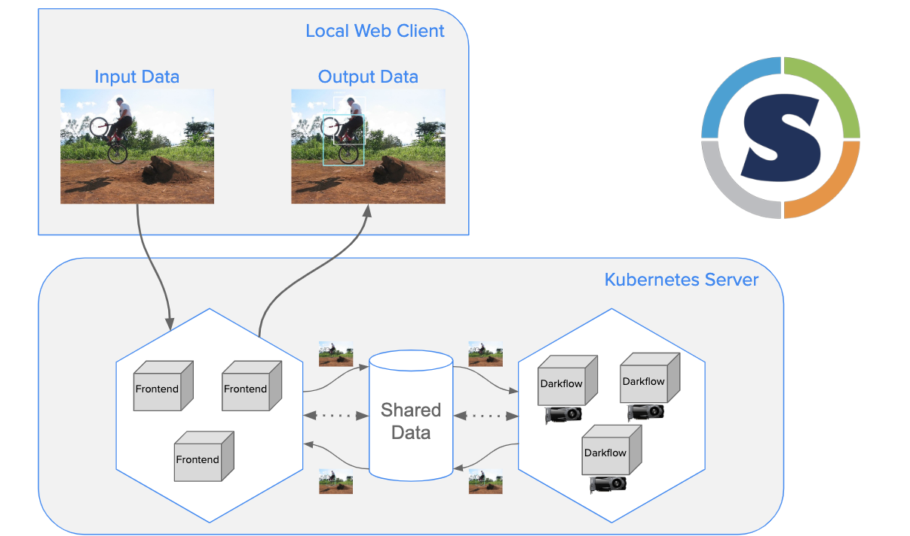

.. _examples:

========
Examples
========

When Singularity-CRI is installed and configured and kubelet is restarted,
you may use Kubernetes as you usually do. Here we will show some examples so you can
verify your installation and probably discover some interesting use cases.

All examples can be found `in Singularity-CRI repo
<https://github.com/sylabs/singularity-cri/tree/master/examples/k8s>`_.
Further assumed you are located in Singularity-CRI repository root.

------------------
Hello, Kubernetes!
------------------

This is a dummy HTTP server suitable to verify Kubernetes installation.

.. code-block:: bash

	$ kubectl apply -f examples/k8s/hello-kubernetes.yaml

After pods are up you should be able to hit hello-kubernetes
`Kubernetes service <https://kubernetes.io/docs/concepts/services-networking/service>`_
and see a web page with "Hello, World!" greeting.

-----------------
Cat images server
-----------------

Here we will walk through a basic Kubernetes example with SIF. We will deploy http file server
that listens on port 8080 and creates a Kubernetes service to make it public on port 80.

.. note::

	To make Singularity-CRI pull image from `cloud library <https://cloud.sylabs.io/library>`_
	an explicit **cloud.sylabs.io** prefix should be specified in image field.

To create a deployment and a service run the following:

.. code-block:: bash

	$ kubectl apply -f examples/k8s/image-service.yaml

To verify objects are indeed created you can do:

.. code-block:: bash

	$ kubectl get deploy && \
	  kubectl get svc

If everything is fine you should be able to access the cats server through the
`Kubernetes service <https://kubernetes.io/docs/concepts/services-networking/service>`_. that has
just been created. There are couple URLs that where created for testing purposes,
``/cats/good`` is the one with cats. Don't question namings 🙃

------------------
Bookshelf service
------------------

This is service for storing and searching books with MongoDB as a storage.
Consists of two parts: MongoDB and a back-end application that provides API.

.. code-block:: bash

	$ kubectl apply -f mongo.yaml && \
	  kubectl apply -f bookshelf.yaml

After that you should be able to interact with bookshelf
`Kubernetes service <https://kubernetes.io/docs/concepts/services-networking/service>`_.

The API is the following:

- List books

.. code-block:: text

	GET /books

- Create new book

.. code-block:: text

	POST /books

.. code-block:: json

	{
	"title": "Les Misérables",
	"author": "Victor Hugo",
	"published_date": "1862",
	"description": "Examining the nature of law and grace, the novel elaborates upon the history of France, the architecture and urban design of Paris, politics, moral philosophy, antimonarchism, justice, religion, and the types and nature of romantic and familial love."
	}

- Update existing book

.. code-block:: text

	PUT /books/<id>

.. code-block:: json

	{
	"title": "Les Misérables",
	"author": "Victor Hugo",
	"published_date": "June 1862",
	"description": "Examining the nature of law and grace, the novel elaborates upon the history of France, the architecture and urban design of Paris, politics, moral philosophy, antimonarchism, justice, religion, and the types and nature of romantic and familial love."
	}

- Get existing book

.. code-block:: text

	GET /books/<id>

- Delete existing book

.. code-block:: text

	POST /books/<id>:delete

----------------------------------
Image recognition using NVIDIA GPU
----------------------------------

Here we will deploy image recognition application that uses NVIDIA GPUs.

To create a deployment and a service run the following:

.. code-block:: bash

	$ kubectl apply -f darkflow.yaml

To verify that objects are indeed created you can do:

.. code-block:: bash

	$ kubectl get deploy && \
	  kubectl get svc

If everything is fine you should be able to access Darkflow UI that is exposed with `darkflow-web`
`Kubernetes service <https://kubernetes.io/docs/concepts/services-networking/service>`_.

.. note::

	You may need to change `serverURL` value in a ConfigMao from the example above according to
	your cluster configuration. It should point to the darkflow-front
	`Kubernetes service <https://kubernetes.io/docs/concepts/services-networking/service>`_.

	Also you can change `input` and `output` directories location on your host.
